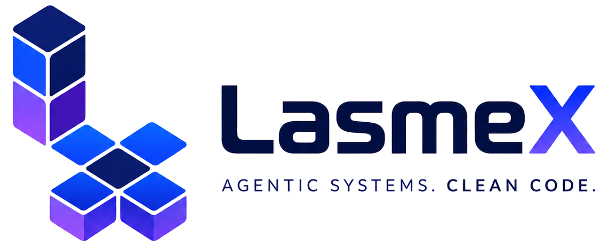

<p align="center"></p>

# LasmeX

[Français](LASMEX.md) | English | [中文](README.zh.md)

LasmeX is a French-first, open-source agent harness maintained at [lasme-ephrem/LasmeX](https://github.com/lasme-ephrem/LasmeX). It is an independent fork of [DeepSeek Harness](https://github.com/deepseek-ai/deepseek-harness) and retains the Cordis architecture in which every capability is a plugin.

## Product

LasmeX Code is the default development agent. The Web and desktop applications include a Mission dashboard for goals, steps, permissions, verification commands, approvals, activity, token usage, and orchestrated children without exposing private reasoning. Durable project memory is bounded, explicit, workspace-scoped, and approval-gated in interactive profiles. Sessions resume from local persistence, while background jobs and subagents remain observable and controllable.

The launcher, npm package family, TypeScript SDK, Python SDK, browser identity, documentation site, and desktop application use the LasmeX identity. User data defaults to `~/.lasmex`, and the launcher disables telemetry inherited from the upstream project.

## Run from source

<a id="run"></a>

Install Node.js 22.19 or newer and pnpm, then run from this checkout:

```sh
pnpm install --frozen-lockfile
pnpm run build
pnpm lasmex web
```

The Web UI is served at `http://127.0.0.1:3080` by default. Set `LASMEX_HOME` to use another user-data directory. Provider credentials remain local and must never be committed.

## Desktop application

Build the portable application for the current operating system with `pnpm desktop:package`. Native distribution commands produce a Windows Squirrel installer, a signed and notarized macOS application ZIP when Apple credentials are configured, or a Linux portable tarball:

```sh
pnpm desktop:make:windows
pnpm desktop:make:macos
pnpm desktop:make:linux
```

Each native artifact is built on its target operating system. Local unsigned builds keep automatic updates disabled; signed release builds require an HTTPS update origin and platform signing credentials.

## Documentation and development

Start with the [French product guide](LASMEX.md), the [user guide](docs/user/guide/index.fr.md), the [development guide](docs/development.md), and the [architecture documentation](docs/architecture.md). Contributors must follow [AGENTS.md](AGENTS.md) and [CONTRIBUTING.md](CONTRIBUTING.md).

The Git remote named `origin` points to the LasmeX repository. The remote named `upstream` tracks DeepSeek Harness for attribution and deliberate upstream synchronization. Product changes remain separate from upstream synchronization work.

## License

[MIT](LICENSE). Third-party dependencies and their licenses are disclosed in [THIRD_PARTY_NOTICES.md](THIRD_PARTY_NOTICES.md).
