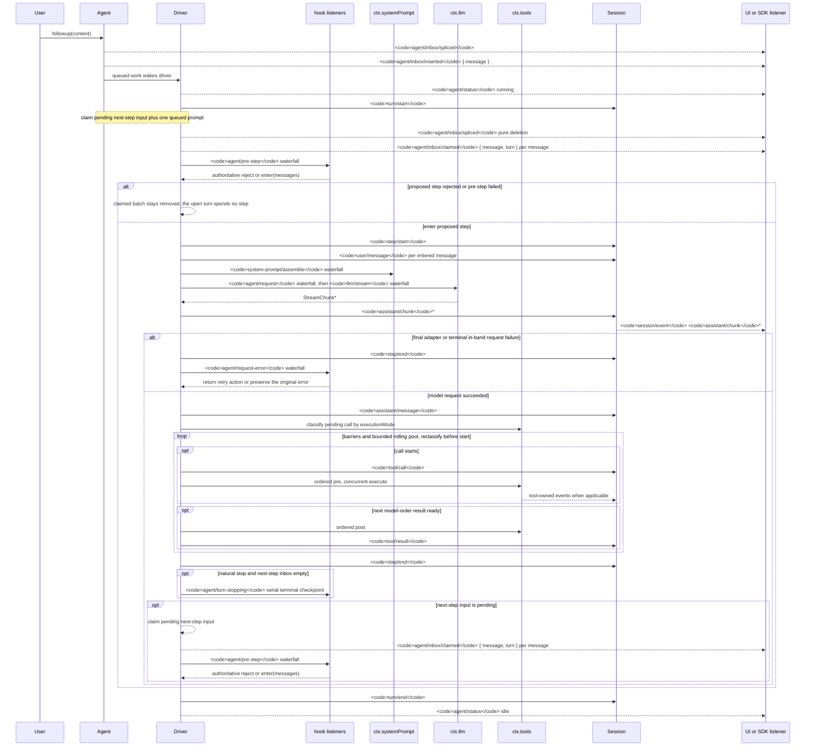

<!-- Generated by scripts/gen-doc-graphs.ts - do not edit by hand.
     Run `pnpm run gen-doc-graphs` to regenerate. -->

# Cycle de vie d’un tour et d’une étape d’agent

Cette séquence accompagne visuellement [architecture.md](architecture.md#turn-flow). Elle place les données durables et rejouables dans `session/event`, et les mécanismes de contrôle ainsi que l’état en direct dans `agent/*`.

L’événement `assistant/message` enregistre chaque appel fournisseur réussi, y compris les fins sans contenu et celles de type `max-tokens`. Le contenu vide est exclu de l’historique dérivé, tandis que l’événement durable conserve l’utilisation et les `sourceEventSeqs` qui énumèrent exactement les événements `assistant/chunk`, y compris sous la forme d’une liste explicitement vide.

`lasmex-compaction-basic` utilise `agent/pre-step` pour détecter la pression avant la dérivation de la requête, et `agent/request-error` uniquement pour un dépassement canonique de la fenêtre de contexte. Dès que l’un de ces déclencheurs est admissible, l’élagage facultatif des résultats d’outils précède le choix du résumé. La récupération intervient entre la fermeture de l’étape en échec et celle du tour en échec ; elle ouvre un nouveau tour de tentative seulement si l’élagage ou la synthèse fait avancer la génération associée au remplacement de la surface. Sinon, l’erreur de requête initiale reste l’autorité.

La décision renvoyée par `agent/pre-step` fait autorité. Les écouteurs qui enveloppent `next()` préservent les messages en aval, sauf si leur remplacement est intentionnel. Le pilotage et le contexte injecté traversent la même cascade après qu’une opération ultérieure a réclamé leur lot pour l’étape suivante.

Les utilisateurs du SDK qui ont besoin d’une transcription rejouable doivent consommer `session/event`. `agent/*` est l’API de coordination en direct pour la file et l’état, l’interception de l’invite, la construction des requêtes, le pilotage, la continuation et les erreurs.

Mode de maintenance : séquence Mermaid organisée manuellement ; les signatures exactes des événements figurent dans le catalogue Cordis généré.
