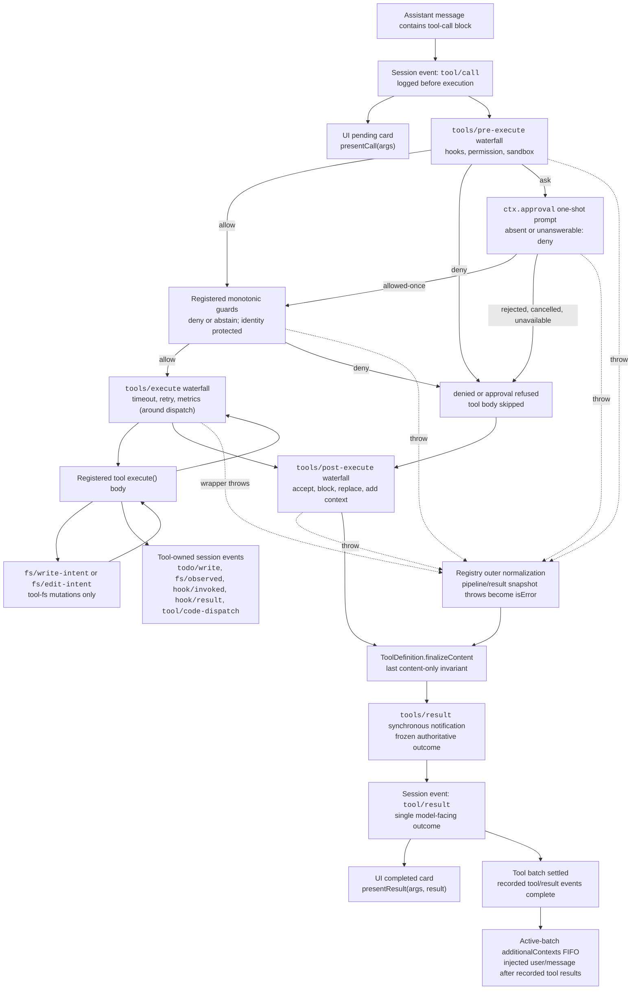

<!-- Generated by scripts/gen-doc-graphs.ts - do not edit by hand.
     Run `pnpm run gen-doc-graphs` to regenerate. -->

# Pipeline d’exécution des outils

Ce graphe indique où s’exécutent les politiques, les hooks, le sandboxing, les protections du système de fichiers, la réécriture des résultats, l’observation du résultat final et le rendu de l’interface, sans modifier la boucle. La waterfall `tools/pre-execute` s’exécute d’abord, suivie des protections monotones, puis des waterfalls `tools/execute` et `tools/post-execute` ; ces trois waterfalls peuvent transformer un appel. Le `finalizeContent` appartenant à la définition et `tools/result` s’exécutent ensuite.

Les vérifications de lecture avant modification du système de fichiers restent sous `tool-fs`, sur les événements `fs/*`. Les waterfalls génériques avant et après l’exécution accueillent les hooks et la politique d’approbation ; `ctx.approval` résout les demandes avant les protections monotones, tandis qu’une politique propriétaire dont l’ordre ne doit pas changer reste une protection enregistrée. Les préoccupations entourant la distribution, telles que les délais d’expiration, enveloppent `tools/execute`. Le registre capture sans perte un instantané du résultat candidat et normalise un échec de cette capture avant que le callback `finalizeContent`, lui-même capturé depuis la définition visible, n’applique son invariant synchrone portant uniquement sur le contenu. `tools/result` observe ensuite le résultat immuable encodable en JSON sans perte. Les hooks peuvent ainsi couvrir plusieurs familles d’outils sans coupler les outils à un service de politique particulier. Code Mode fait passer par le pipeline à la fois le transport réservé `run_code` et ses sous-appels sérialisés ; les sous-appels transportent le jeton parent, consignent `tool/code-dispatch`, renvoient les refus sous forme de rejets de liaison et omettent `additionalContexts` afin de préserver l’adjacence entre appel et résultat.

Mode de maintenance : graphe Mermaid conservé manuellement ; les schémas d’outils et signatures d’événements exacts se trouvent dans les catalogues générés.
